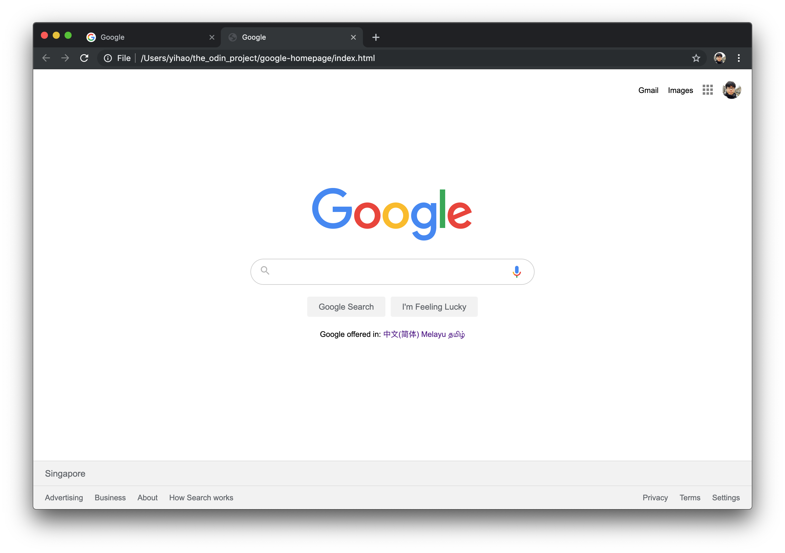

# Hello World (HTML & CSS)

My first HTML & CSS mini practice project!

Replicating the look of [Google.com](www.google.com) homepage (without functionality)

From The Odin Project's [curriculum](http://www.theodinproject.com/courses/web-development-101/lessons/html-css)

My version:

Original:
